# SDC Engineering Journal and Notes

Brenton Hershner

## API Specifications
### Which api did you choose? Why?

- Product. We decided on Group 3’s FEC app before selecting our api’s. Tony did the Product Detail Module for Group 3 so he couldn’t do the Product api. Gabe was interested in Q&A over 

### What will you have to do to recreate this api? 

- Implement a relational database to access and deliver the data.

### Find ways to scale the deployment and make the api as performant as possible. 

### What is it’s main functionality or purpose?

- Deliver the results of a query to the product endpoint

### What are important design/styles to create for the user experience?

- Very fast and efficient code. Scalable infrastructure.

### Performance notes

- What did you try? // Todo
- What is the difference in performance? // Todo
- Does the page load faster or create a better user experience? // Todo

## Other Notes

Error Messages / Resources / New Techniques you learned, etc.


## Template or suggested daily topics:

- What went well?  What could be improved?
- What went badly?  What have you tried? What is next step?
- What observations do you have on the work done today? Yours? Others?
- Not many. Just initial understanding of the problem at hand.
- What pointers or advice would you give someone who is facing the day you just had?  
- I wish I’d….
- What bugs/problems did you encounter? How did you explore it? How did you get past it?

---
## Daily Reflections 2021-05-03 W8D1

- Setup a Trello board for the group.
- Selected a set of technologies to be implemented in the SDC sprint.
- Defined a database schema for the product api.


What went well?  What could be improved?
  - Good first day with the new group. We setup a lot of sytems. We were unclear on some of the requirements. We could have asked clarifying questions sooner.

What went badly?  What have you tried? What is next step?
  - The Google form link didn’t work for many. Someone asked for help but it didn’t seem too important so the answer was deferred until tomorrow morning.

## Daily Reflections 2021-05-04 W8D2

- Fought quite a bit with the installation of postgress. Josh suggested that I might have installed it correctly in the beginning but just had permission issues with logging into a specific database. He added that you need to create a new user account and assign it specific permissions in order to interact with the database.

## Daily Reflections 2021-05-05 W8D3

- Spent a lot of time trying to determine how to best parse the csv data and save it back as a cleaned file.
- Csv-parse and csv-parser are ***NOT*** the same.
- Parsing a csv with mismatched quotes needs to be done by ignoring the quote character. `parse({quote:false})` and then replace all the quotes by using a regular expression since node doesn't allow for replaceAll (strangely).

## Daily Reflections 2021-05-06 W8D4

- Before effective cleaning functions could be written, the problems in the data first had to understood. The cleaning funciton for each table was written to generate an object which reported information about the records. For example how many records had 3 fields and how many had 4. For fields that appeared to be numbers, what was the total number of records that were able to be converted into a number and did that match the total number of records. For records with only a few possibilities, like sizes ranging from XXS to XXL and 5 to 14 incrementing by 0.5, were there any skus that didn't fit this format? I also added a line to console log every 100,000 records so that I knew it was still running and not to interupt it.

Here is an examle of the output of this function after the data has been cleaned:

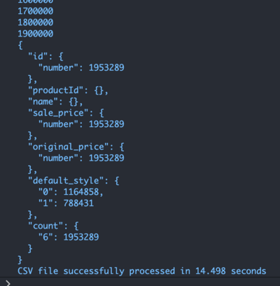

## Daily Reflections 2021-05-07 W8D5

- To start up the postgres server:
    `pg_ctl -D /usr/local/var/postgres start`

[How to Start a PostgreSQL Server](https://dataschool.com/learn-sql/how-to-start-a-postgresql-server-on-mac-os-x/)

- To run psql as the default user:
    `psql postgres`
- To run a file from within postgres: `\i filename`
- With a filepath [How to run an SQL file in Postgres](https://kb.objectrocket.com/postgresql/how-to-run-an-sql-file-in-postgres-846): `\i /Users/brentonhershner/sw/hr/SDC/Tobrega-Products/database/schema.sql;`
- Alternatively, it can be loaded with javascript: - [Import CSV data into PostgreSQL using Node.js](https://bezkoder.com/node-js-csv-postgresql/)

- Navigating within psql:
  ```
  \cd ..
  \cd folder
  \! ls -l
  ```
- When creating tables, use commas but **not** after the last statement. Also, don't forget your semicolons.
- In Postgres, use `TEXT` instead of `VARCHAR(n)` for unlimited length.
- **Be careful about syntax differences with mySQL!!!**
  - UNSIGNED and TINYINT are not a valid data types in postgres. Use INTEGER instead of INT.
    
    [What is the difference between tinyint smallint medium int big int and int](https://stackoverflow.com/questions/2991405/what-is-the-difference-between-tinyint-smallint-mediumint-bigint-and-int-in-m)
- The order of arguments from COPY FROM matter. After some trial, error, and stack overflow, the following finally worked.
    ```
    COPY product FROM '/Users/otherfolders/Tobrega-Products/data/example/cleaned/product.csv' WITH delimiter ',' NULL AS 'null' csv header;
    ```

    [Copy NULL values present in csv file to postgres](https://stackoverflow.com/questions/19034674/copy-null-values-present-in-csv-file-to-postgres)

- Finally loaded the cleaned data. It took longer than I had hoped, but it's in and it loads in amazingly fast.

    
- Starting to make requests and writing out the functions to match the specific API calls.
- Timing queries is actually really simple. Just run `\timing`
- [On pool vs client connections](https://stackoverflow.com/questions/48751505/how-can-i-choose-between-client-or-pool-for-node-postgres)

## Daily Reflections 2021-05-08 W8D6

- Spent some time down a rabbit hole of how to make a better markdown engineering journal. Installed a VS Code extension called [Paste Image](https://marketplace.visualstudio.com/items?itemName=mushan.vscode-paste-image) to allow me to drop screenshots right in with a shortcut (⌘⌥v)
- Added notes in the form of [JSDoc](https://jsdoc.app/index.html) to the routes for the product api calls.
- Modifying the project structure a bit to follow this example on the node-postgres documentation page. [Suggested Project Structure](https://node-postgres.com/guides/project-structure)

- A VERY simple query took 0.422 ms. Off to a good start, but I'm sure it will only get more time consuming as I start joining tables...
    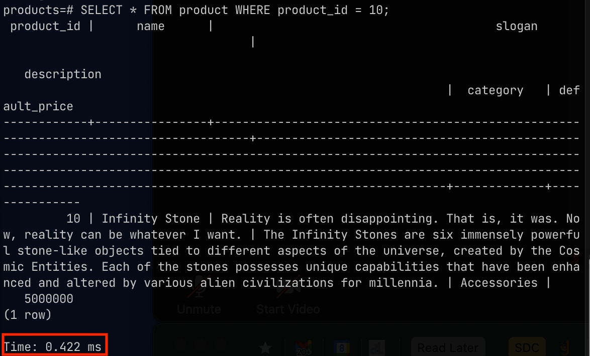

## Daily Reflections 2021-05-10 W9D1

- Spent some time testing different ways to organize the code and function calls. I'm trying to make sure it's clean and each function ends up where it makes the most sense.

- Following the pg guide with async await queries, the first query is in the bag. What's the catch? This seems too easy. I must be missing something. Boiling it all down, this is the query definition: 

```const query = async (text, params) => pool.query(text, params);```

  ...and here is the code for the Product Information query:

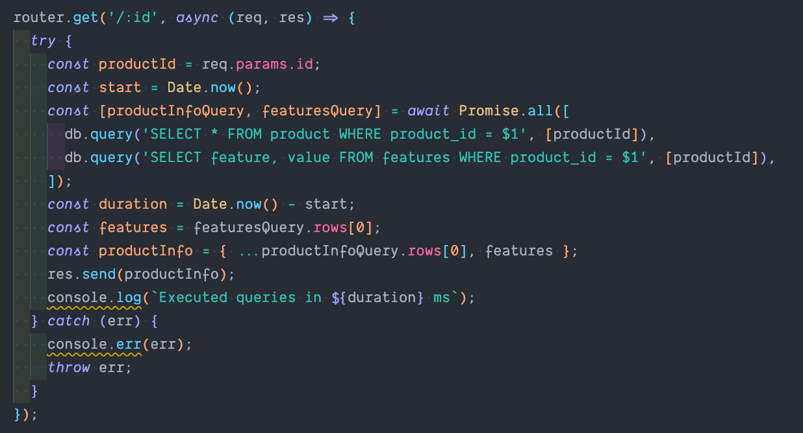

| Product_id | Response time |
| --- | --- |
| 50 | 111 ms |
| 500000 | 109 ms |
| 990000 | 116 ms |

- Most of my time today has been fighting to understand how to use and the differences between array_to_json, array_agg, row_to_json functions in postgresql queries.

## Daily Reflections 2021-05-11 W9D2

Pete shared with me a really great article about how to return JSON objects from PostgreSQL queries. It really helped! Thanks Pete!!!

[Query Nested Data in Postgres using Node.js](https://itnext.io/query-nested-data-in-postgres-using-node-js-35e985368ea4)

Finally getting somewhere with my style query. 
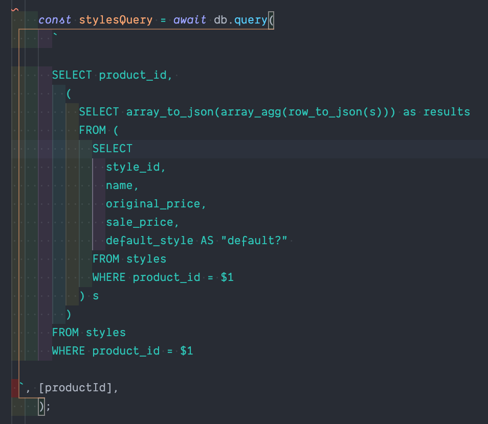

Response time for this query midway in the data uncached and without indexing is 200 ms.

Alright. Now I've incorporated the photos but query times have gone way up. 2.5 seconds. 😳😬

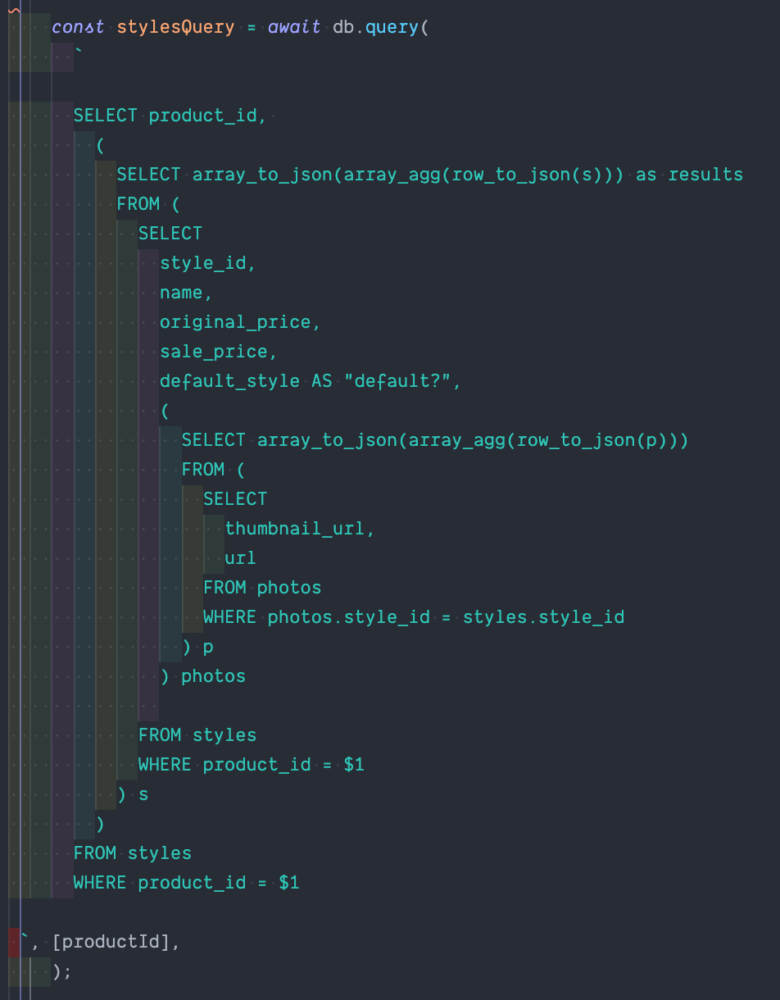

Had to use json_object_agg and json_build_object in order to finally get the query shape correct. Query time is 3.5 seconds without optimization or indexing.

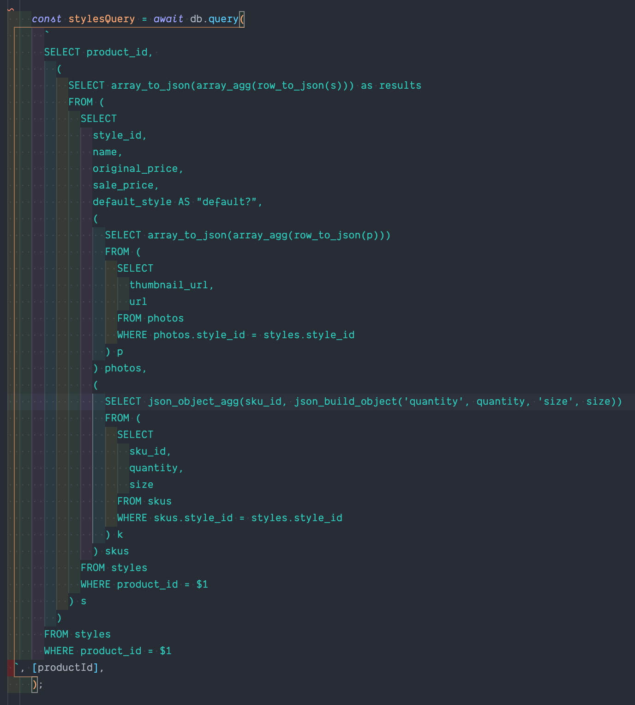

Seems really slow but I didn't think the product info was very slow. Product info is doing two queries and didn't see so relatively slow. I'm going to revisit the product info...

ProductInfo  with a query to get most of the product info and then another query to fetch the features. Now I know enough that I can rewrite this to be returned in a single query.

After some testing, it seems the difference is neglidgeable but actually faster to do 2 separate queries... Not what I expected but at least I'm getting better at nested queries!

product_id:3
| # of queries | Response time |
| --- | --- |
| 2 queries | 80 ms |
| 1 query | 84 ms |

#### So close, but still no cigar...

The query for related products is close... The query (below) is generating an object with "array_agg" as the key and the result I want as the value. I can't figure out how to just return the value out of this object by using SQL. Sure, it would be trivially easy to pull it out using javascript, but I didn't sign up for Hack Reactor to take the easy way out!!!

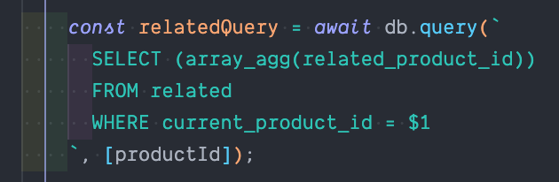

This is the query and it's result:

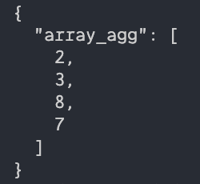

List Products is similar. It's pretty much done. The pagination even works, but I can't figure out how to pull the value out of the object via SQL.. The following is the query and result.

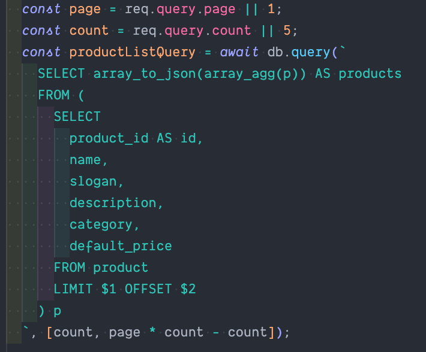

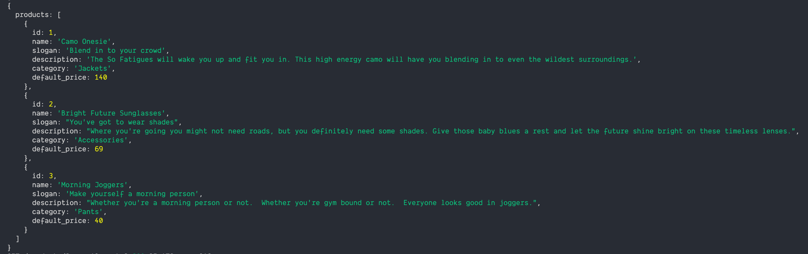

## Daily Reflections 2021-05-12 W9D3

I give up trying to return just an array. I've tried about 10 different ways but can't figure it out.

Starting to test:

|  | Product | Styles | Related |
| --- | --- | --- | --- |
| rows | 997483 | 1958101 | 1136021 |
| last product_id | 1000011 | 1000011 | 296448 |


| Description      | k6 avg pre-index | k6 avg w/indexing |
| ---------------- | ------ | --- |
| List Products    | 213 ms  |  |
| Product Info     | 283 ms |  |
| Product Styles   | 4.74 s |  |
| Related Products | 159 ms |  |

### k6 testing locally

    brew  install k6

Following k6's documentation:

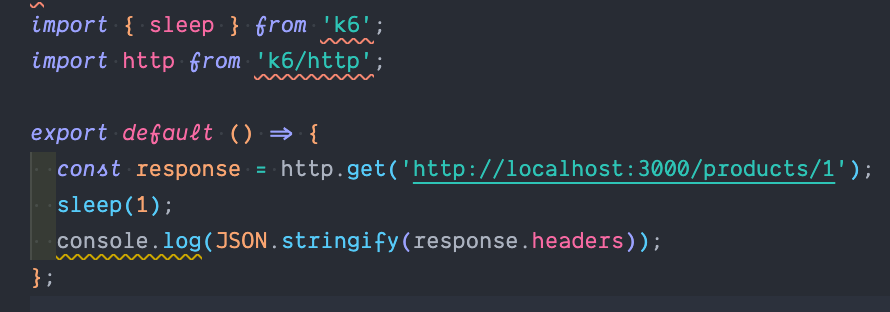

resulted in this, very poor performance...

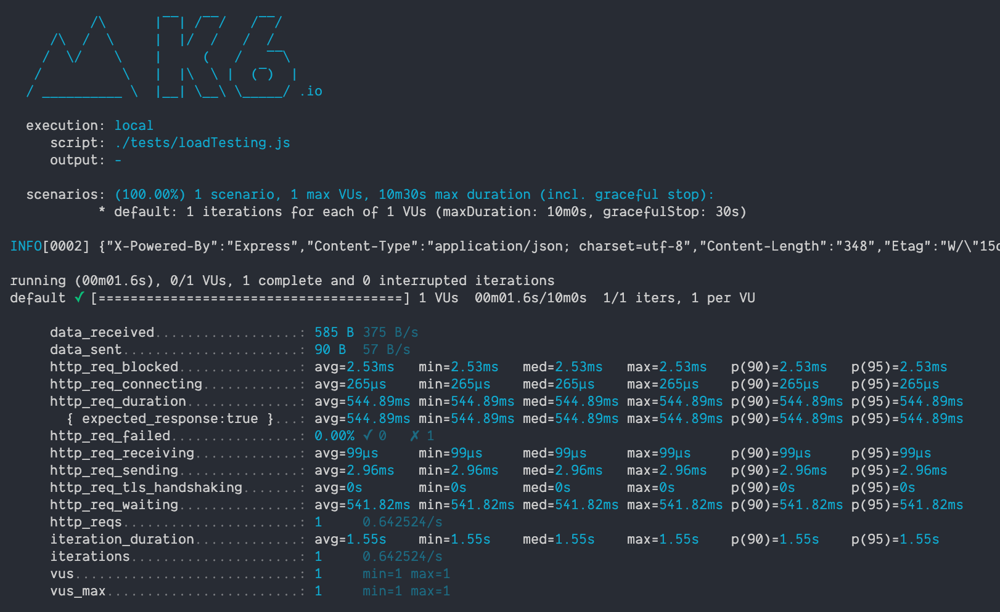


- Need load balances for each server endpoint. Need a load balancer to direct to different clients too.

- loader.io for deployed testing

And I think I randomly found what I was looking for to just return the value and not an object with a key value pair. This is from the [pg documentaiton](https://node-postgres.com/features/queries)

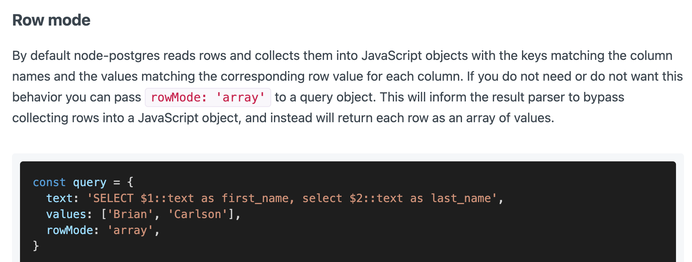

---

## References and Handy Dandy Links

- [Postgres Cheat Sheet](https://www.postgresqltutorial.com/postgresql-cheat-sheet/)
- [Postgres Cheat Sheet (pdf)](https://www.postgresqltutorial.com/wp-content/uploads/2018/03/PostgreSQL-Cheat-Sheet.pdf)
- [How to run an SQL file in Postgres](https://kb.objectrocket.com/postgresql/how-to-run-an-sql-file-in-postgres-846)
- [17 Practial psql Commands That You Don't Want To Miss](https://www.postgresqltutorial.com/psql-commands/)


