# SDC Engineering Journal and Notes

Brenton Hershner

## API Specifications
### Which api did you choose? Why?

- Product. We decided on Group 3’s FEC app before selecting our api’s. Tony did the Product Detail Module for Group 3 so he couldn’t do the Product api. Gabe was interested in Q&A over 

### What will you have to do to recreate this api? 

- Implement a relational database to access and deliver the data.

### Find ways to scale the deployment and make the api as performant as possible. 

### What is it’s main functionality or purpose?

- Deliver the results of a query to the product endpoint

### What are important design/styles to create for the user experience?

- Very fast and efficient code. Scalable infrastructure.

### Performance notes

- What did you try? // Todo
- What is the difference in performance? // Todo
- Does the page load faster or create a better user experience? // Todo

## Other Notes

Error Messages / Resources / New Techniques you learned, etc.


## Template or suggested daily topics:

- What went well?  What could be improved?
- What went badly?  What have you tried? What is next step?
- What observations do you have on the work done today? Yours? Others?
- Not many. Just initial understanding of the problem at hand.
- What pointers or advice would you give someone who is facing the day you just had?  
- I wish I’d….
- What bugs/problems did you encounter? How did you explore it? How did you get past it?

---
## Daily Reflections 2021-05-03 W8D1

- Setup a Trello board for the group.
- Selected a set of technologies to be implemented in the SDC sprint.
- Defined a database schema for the product api.


What went well?  What could be improved?
  - Good first day with the new group. We setup a lot of sytems. We were unclear on some of the requirements. We could have asked clarifying questions sooner.

What went badly?  What have you tried? What is next step?
  - The Google form link didn’t work for many. Someone asked for help but it didn’t seem too important so the answer was deferred until tomorrow morning.

## Daily Reflections 2021-05-04 W8D2

- Fought quite a bit with the installation of postgress. Josh suggested that I might have installed it correctly in the beginning but just had permission issues with logging into a specific database. He added that you need to create a new user account and assign it specific permissions in order to interact with the database.

## Daily Reflections 2021-05-05 W8D3

- Spent a lot of time trying to determine how to best parse the csv data and save it back as a cleaned file.
- Csv-parse and csv-parser are ***NOT*** the same.
- Parsing a csv with mismatched quotes needs to be done by ignoring the quote character. `parse({quote:false})` and then replace all the quotes by using a regular expression since node doesn't allow for replaceAll (strangely).

## Daily Reflections 2021-05-06 W8D4

- Before effective cleaning functions could be written, the problems in the data first had to understood. The cleaning funciton for each table was written to generate an object which reported information about the records. For example how many records had 3 fields and how many had 4. For fields that appeared to be numbers, what was the total number of records that were able to be converted into a number and did that match the total number of records. For records with only a few possibilities, like sizes ranging from XXS to XXL and 5 to 14 incrementing by 0.5, were there any skus that didn't fit this format? I also added a line to console log every 100,000 records so that I knew it was still running and not to interupt it.

Here is an examle of the output of this function after the data has been cleaned:


## Daily Reflections 2021-05-07 W8D5

- To start up the postgres server:
    `pg_ctl -D /usr/local/var/postgres start`

[How to Start a PostgreSQL Server](https://dataschool.com/learn-sql/how-to-start-a-postgresql-server-on-mac-os-x/)

- To run psql as the default user:
    `psql postgres`
- To run a file from within postgres: `\i filename`
- With a filepath [How to run an SQL file in Postgres](https://kb.objectrocket.com/postgresql/how-to-run-an-sql-file-in-postgres-846): `\i /Users/brentonhershner/sw/hr/SDC/Tobrega-Products/database/schema.sql;`
- Alternatively, it can be loaded with javascript: - [Import CSV data into PostgreSQL using Node.js](https://bezkoder.com/node-js-csv-postgresql/)

- Navigating within psql:
  ```
  \cd ..
  \cd folder
  \! ls -l
  ```
- When creating tables, use commas but **not** after the last statement. Also, don't forget your semicolons.
- In Postgres, use `TEXT` instead of `VARCHAR(n)` for unlimited length.
- **Be careful about syntax differences with mySQL!!!**
  - UNSIGNED and TINYINT are not a valid data types in postgres. Use INTEGER instead of INT.
    
    [What is the difference between tinyint smallint medium int big int and int](https://stackoverflow.com/questions/2991405/what-is-the-difference-between-tinyint-smallint-mediumint-bigint-and-int-in-m)
- The order of arguments from COPY FROM matter. After some trial, error, and stack overflow, the following finally worked.
    ```
    COPY product FROM '/Users/otherfolders/Tobrega-Products/data/example/cleaned/product.csv' WITH delimiter ',' NULL AS 'null' csv header;
    ```

    [Copy NULL values present in csv file to postgres](https://stackoverflow.com/questions/19034674/copy-null-values-present-in-csv-file-to-postgres)

- Finally loaded the cleaned data. It took longer than I had hoped, but it's in and it loads in amazingly fast.

- Starting to make requests and writing out the functions to match the specific API calls.
- Timing queries is actually really simple. Just run `\timing`
- [On pool vs client connections](https://stackoverflow.com/questions/48751505/how-can-i-choose-between-client-or-pool-for-node-postgres)

## Daily Reflections 2021-05-08 W8D6

- Spent some time down a rabbit hole of how to make a better markdown engineering journal. Installed a VS Code extension called [Paste Image](https://marketplace.visualstudio.com/items?itemName=mushan.vscode-paste-image) to allow me to drop screenshots right in with a shortcut (⌘⌥v)
- Added notes in the form of [JSDoc](https://jsdoc.app/index.html) to the routes for the product api calls.
- Modifying the project structure a bit to follow this example on the node-postgres documentation page. [Suggested Project Structure](https://node-postgres.com/guides/project-structure)

- A VERY simple query took 0.422 ms. Off to a good start, but I'm sure it will only get more time consuming as I start joining tables...
    

## Daily Reflections 2021-05-10 W9D1

- Spent some time testing different ways to organize the code and function calls. I'm trying to make sure it's clean and each function ends up where it makes the most sense.

- Following the pg guide with async await queries, the first query is in the bag. What's the catch? This seems too easy. I must be missing something. Boiling it all down, this is the query definition: 

```const query = async (text, params) => pool.query(text, params);```

  ...and here is the code for the Product Information query:


| Product_id | Response time |
| --- | --- |
| 50 | 111 ms |
| 500000 | 109 ms |
| 990000 | 116 ms |

- Most of my time today has been fighting to understand how to use and the differences between array_to_json, array_agg, row_to_json functions in postgresql queries.

## Daily Reflections 2021-05-11 W9D2

Pete shared with me a really great article about how to return JSON objects from PostgreSQL queries. It really helped! Thanks Pete!!!

[Query Nested Data in Postgres using Node.js](https://itnext.io/query-nested-data-in-postgres-using-node-js-35e985368ea4)

Finally getting somewhere with my style query.


Response time for this query midway in the data uncached and without indexing is 200 ms.

Alright. Now I've incorporated the photos but query times have gone way up. 2.5 seconds. 😳😬


Had to use json_object_agg and json_build_object in order to finally get the query shape correct. Query time is 3.5 seconds without optimization or indexing.


Seems really slow but I didn't think the product info was very slow. Product info is doing two queries and didn't see so relatively slow. I'm going to revisit the product info...

ProductInfo  with a query to get most of the product info and then another query to fetch the features. Now I know enough that I can rewrite this to be returned in a single query.

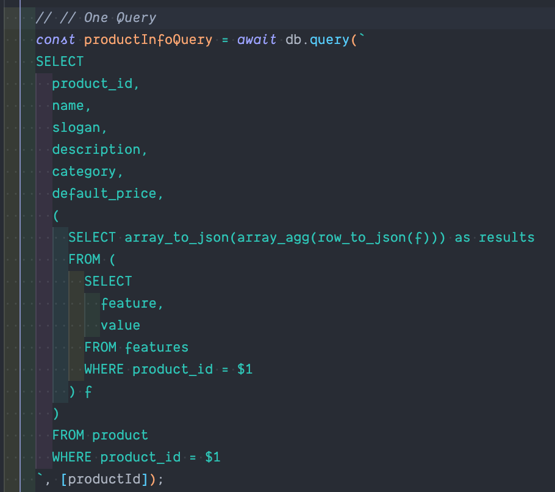

After some testing, it seems the difference is neglidgeable but actually faster to do 2 separate queries... Not what I expected but at least I'm getting better at nested queries!

product_id:3
| # of queries | Response time |
| --- | --- |
| 2 queries | 80 ms |
| 1 query | 84 ms |

#### So close, but still no cigar...

The query for related products is close... The query (below) is generating an object with "array_agg" as the key and the result I want as the value. I can't figure out how to just return the value out of this object by using SQL. Sure, it would be trivially easy to pull it out using javascript, but I didn't sign up for Hack Reactor to take the easy way out!!!


This is the query and it's result:


List Products is similar. It's pretty much done. The pagination even works, but I can't figure out how to pull the value out of the object via SQL.. The following is the query and result.


## Daily Reflections 2021-05-12 W9D3

I give up trying to return just an array. I've tried about 10 different ways but can't figure it out.

Starting to test:

|  | Product | Styles | Related |
| --- | --- | --- | --- |
| rows | 997483 | 1958101 | 1136021 |
| last product_id | 1000011 | 1000011 | 296448 |


| Description      | k6 avg pre-index | k6 avg w/indexing |
| ---------------- | ------ | --- |
| List Products    | 213 ms  | 289 ms |
| Product Info     | 283 ms | 297 ms |
| Product Styles   | 4.74 s | 4.22 s |
| Related Products | 159 ms | 204 ms |

### k6 testing locally

    brew  install k6

Following k6's documentation:


resulted in this, very poor performance...


I believe I figured out why I couldn't return just an array but an object with the array I want as a value of that object... I believe it has to do with the rowMode option within node-postgres (pg). A description of it is in the [documentation](https://node-postgres.com/features/queries).

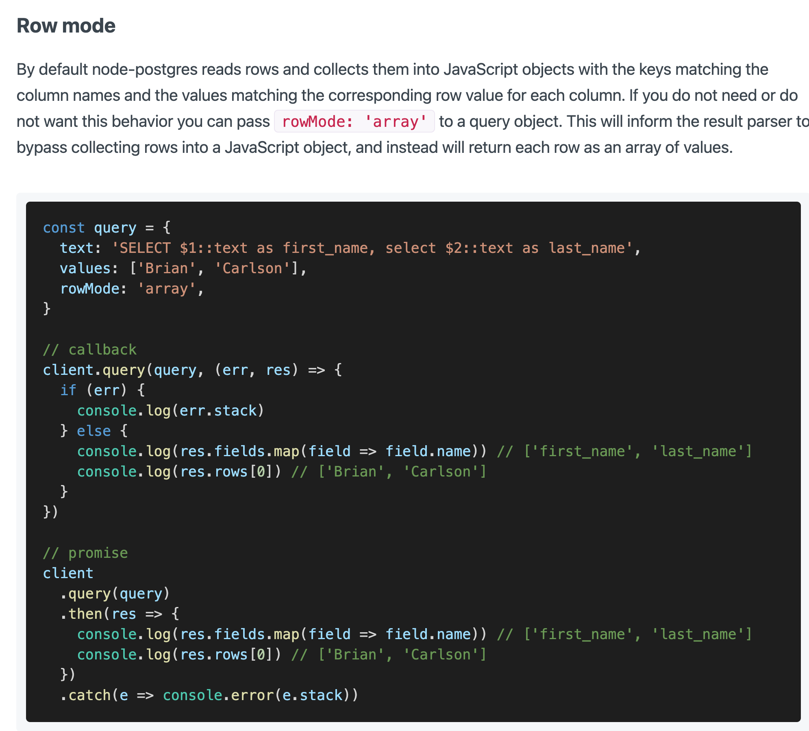

### Summary of query speed problem

All queries are about 1000 times slower when using the server when compared to running in the postgres terminal.

Here is the all in one query for styles:

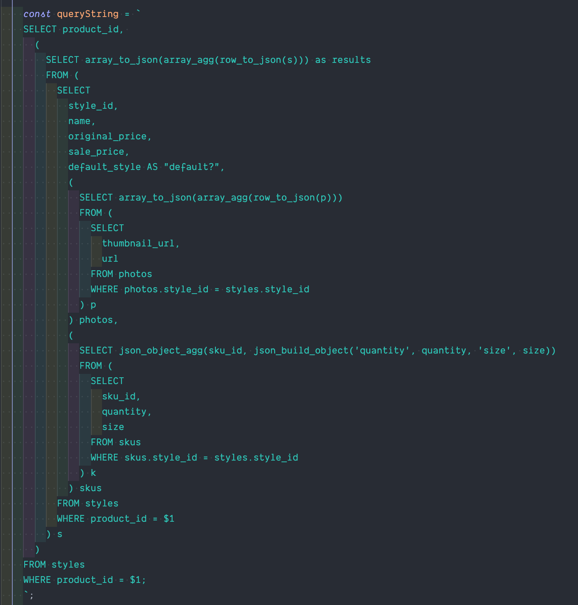

This is the schema and how it's indexed:

!

This is how the database is being connected to:

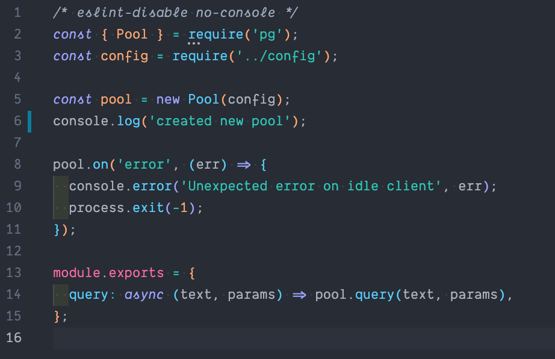

This is the database config file. I've tried increaseing the number of clients for the pool and increasing the idle and connection timeouts to no effect:

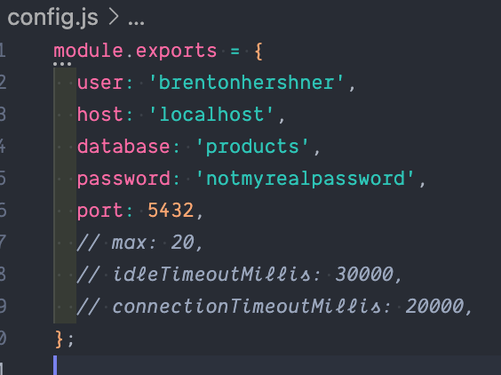

This is how I've setup my server. I've also tried to write my queries directly in this file to avoid routing altogether to no avail...:

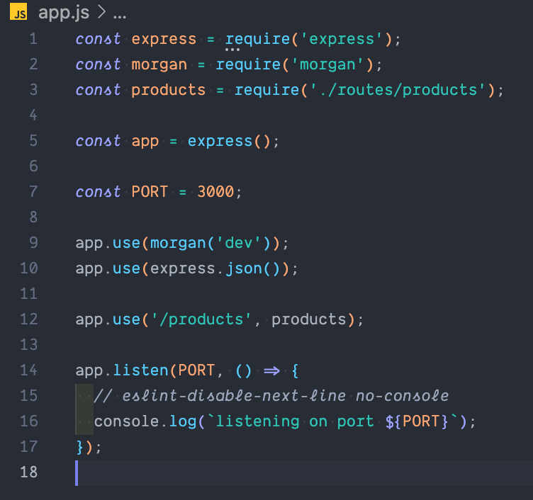

I'm load testing by hitting a random style within +/- 2.5 percentile from three points in the database (5th percentile, 50th percentile, and 95th percentile).

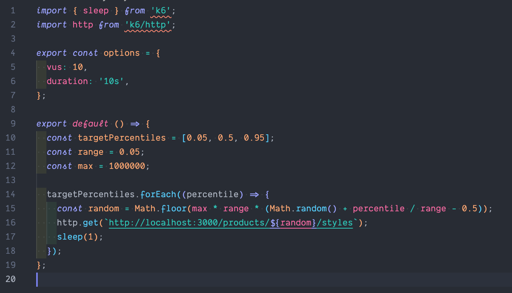

Here is the result in k6:

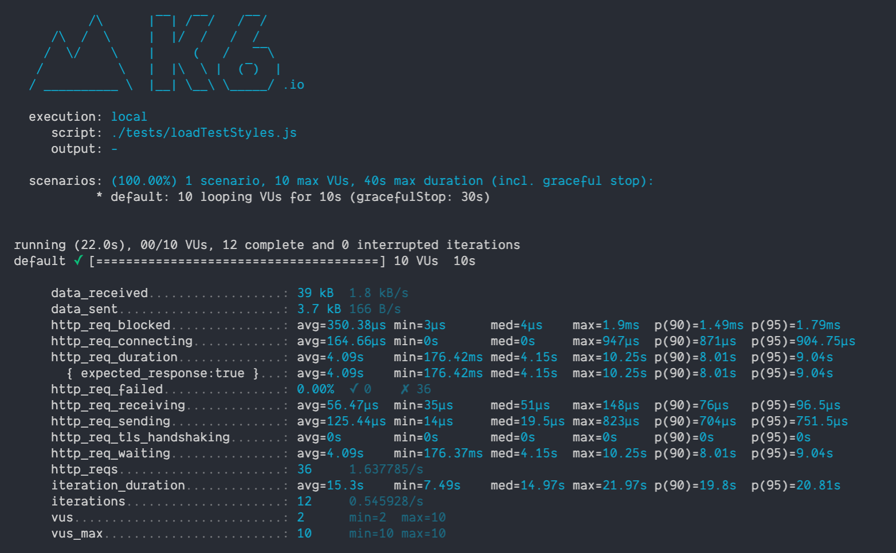

And here are the console logs from the morgan middleware, which I've tried to disable to see if that was the problem. Narrator: "It was not":

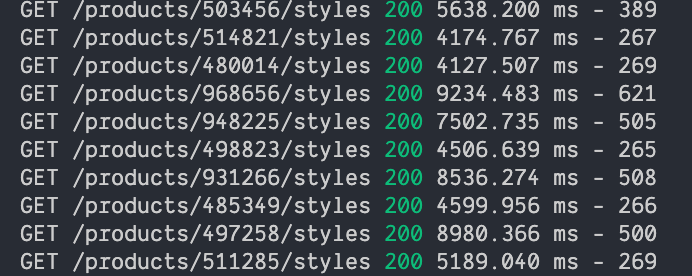

At someone's suggestion, I tried postman too to see if it was any different. Same.

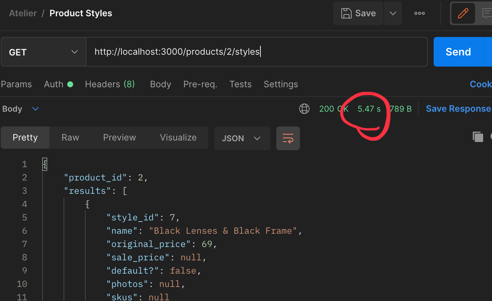

This problem does seem to be caused by the server because the query when copied and pasted into the postgres terminal, it returns results in ***one-thousanth*** of the time **(4.160 ms)**.

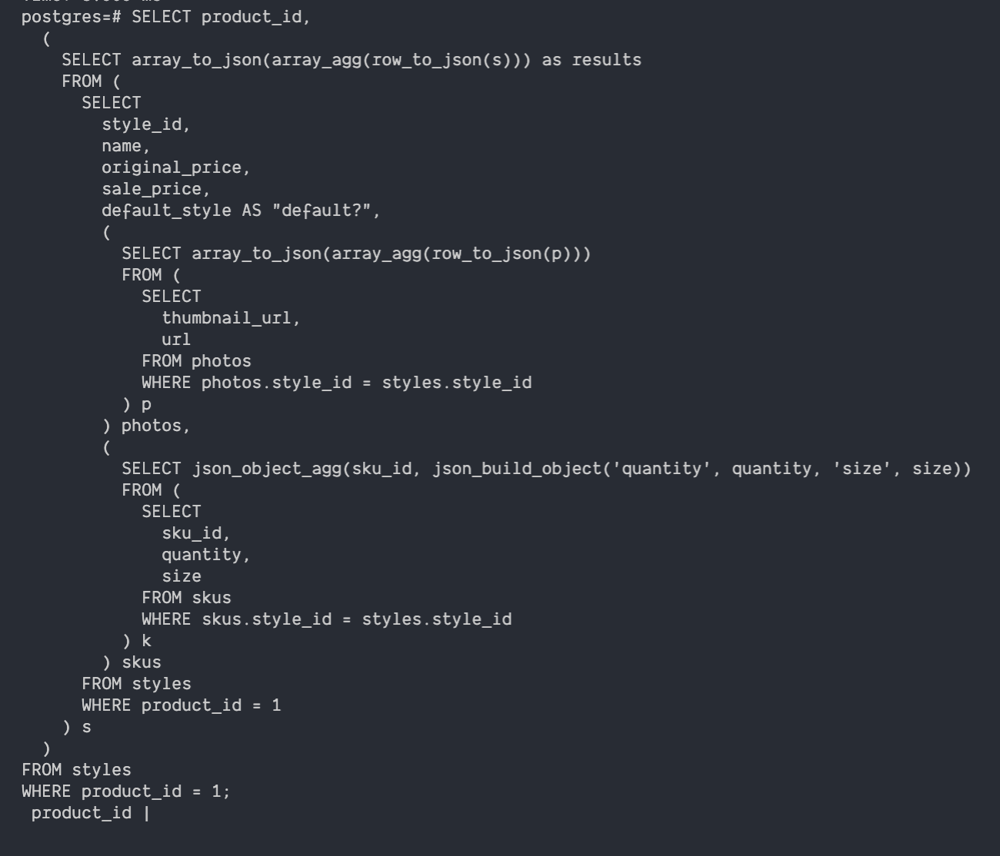

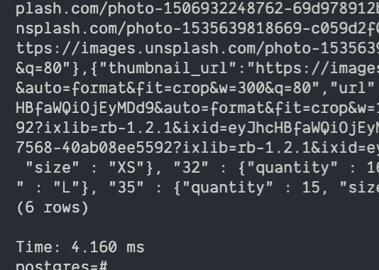

EXPLAIN ANALYZE gave me this result when running through the server (**4112.808 ms**):

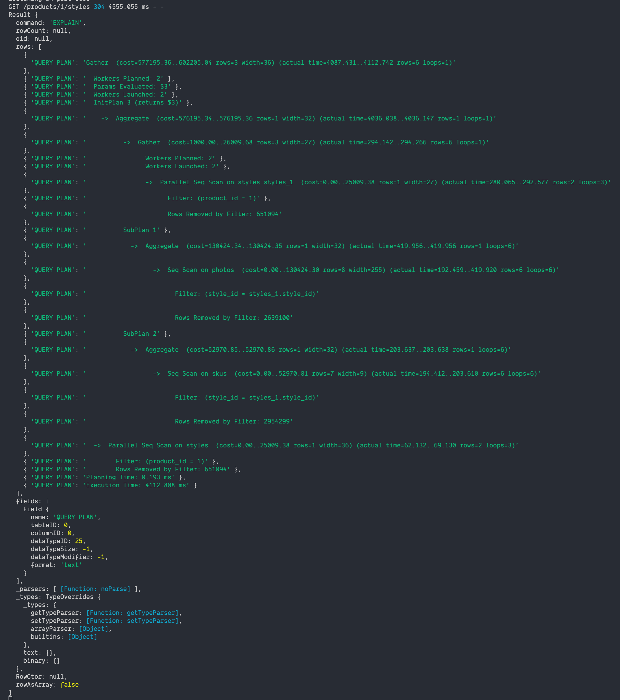

EXPLAIN ANALYZE analysis is below:

      EXPLAIN ANALYZE SELECT product_id,
        (
          SELECT array_to_json(array_agg(row_to_json(s))) as results
          FROM (
            SELECT
              style_id,
              name,
              original_price,
              sale_price,
              default_style AS "default?",
              (
                SELECT array_to_json(array_agg(row_to_json(p)))
                FROM (
                  SELECT
                    thumbnail_url,
                    url
                  FROM photos
                  WHERE photos.style_id = styles.style_id
                ) p
              ) photos,
              (
                SELECT json_object_agg(sku_id, json_build_object('quantity', quantity, 'size', size))
                FROM (
                  SELECT
                    sku_id,
                    quantity,
                    size
                  FROM skus
                  WHERE skus.style_id = styles.style_id
                ) k
              ) skus
            FROM styles
            WHERE product_id = 1
          ) s
        )
      FROM styles
      WHERE product_id = 1;

EXPLAIN ANALYZE from the above query using psql (**0.336 ms**)

     QUERY PLAN
     Index Only Scan using product_id_styles_index on styles  (cost=60.61..64.66 rows=3 width=36) (actual time=0.273..0.276 rows=6 loops=1)
       Index Cond: (product_id = 1)
       Heap Fetches: 0
       InitPlan 3 (returns $2)
         ->  Aggregate  (cost=60.17..60.18 rows=1 width=32) (actual time=0.255..0.256 rows=1 loops=1)
               ->  Index Scan using product_id_styles_index on styles styles_1  (cost=0.43..8.48 rows=3 width=27) (actual time=0.007..0.009 rows=6 loops=1)
                     Index Cond: (product_id = 1)
               SubPlan 1
                 ->  Aggregate  (cost=8.61..8.62 rows=1 width=32) (actual time=0.017..0.017 rows=1 loops=6)
                       ->  Index Scan using style_id_photos_index on photos  (cost=0.43..8.57 rows=8 width=255) (actual time=0.003..0.004 rows=6 loops=6)
                             Index Cond: (style_id = styles_1.style_id)
               SubPlan 2
                 ->  Aggregate  (cost=8.59..8.60 rows=1 width=32) (actual time=0.011..0.011 rows=1 loops=6)
                       ->  Index Scan using style_id_skus_index on skus  (cost=0.43..8.55 rows=7 width=9) (actual time=0.002..0.003 rows=6 loops=6)
                             Index Cond: (style_id = styles_1.style_id)
    Planning Time: 0.230 ms
    Execution Time: 0.336 ms
    (17 rows)

[Analysis from explain.depesz.com](https://explain.depesz.com/s/VQ8R)

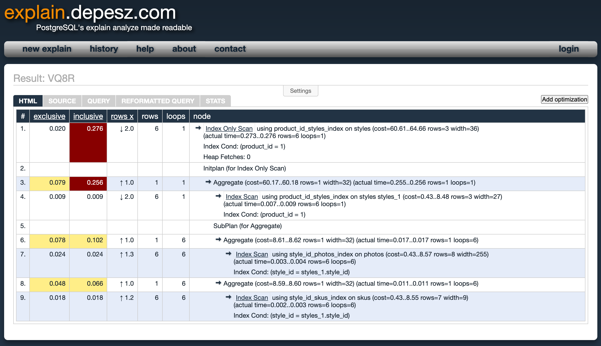

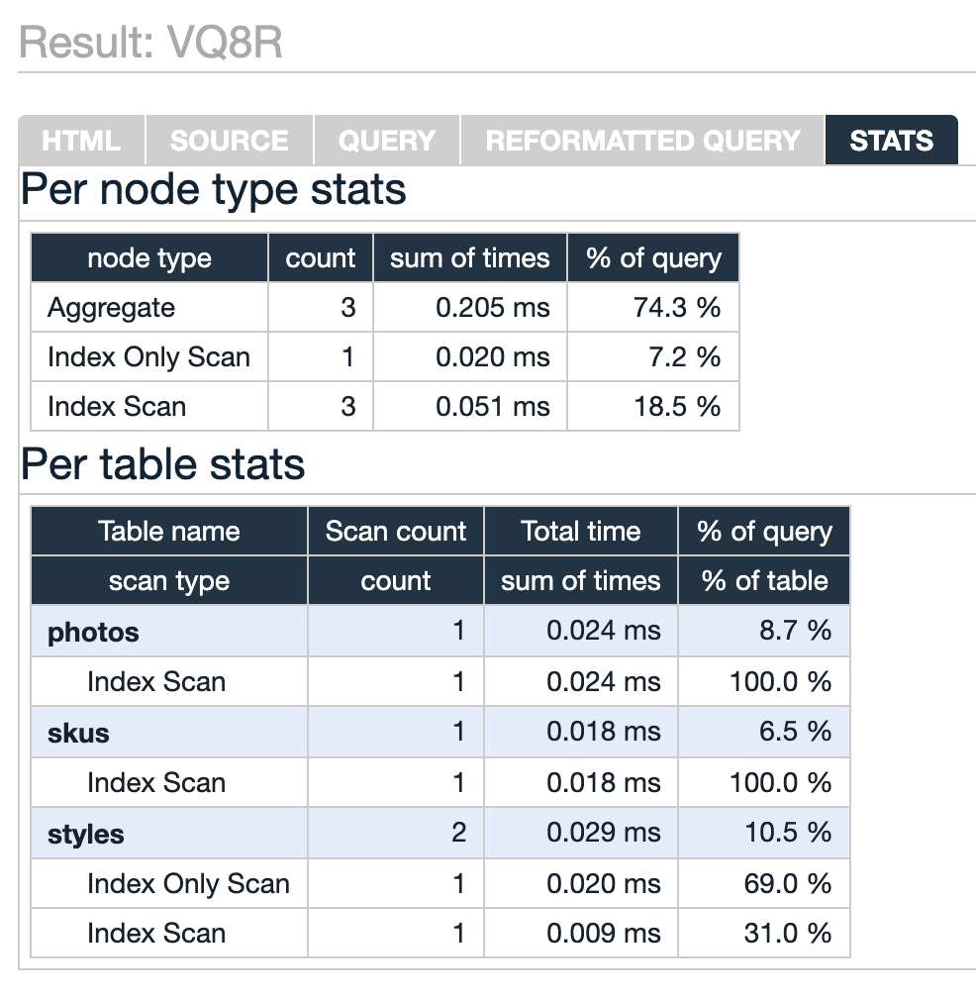

EXPLAIN ANALYZE from the above query using pg (**4112.8 ms**)

    QUERY PLAN
      Gather  (cost=577195.36..602205.04 rows=3 width=36) (actual time=4087.431..4112.742 rows=6 loops=1)
       Workers Planned: 2
       Params Evaluated: $3
       Workers Launched: 2
       InitPlan 3 (returns $3)
          ->  Aggregate  (cost=576195.34..576195.36 rows=1 width=32) (actual time=4036.038..4036.147 rows=1 loops=1)
                ->  Gather  (cost=1000.00..26009.68 rows=3 width=27) (actual time=294.142..294.266 rows=6 loops=1)
                     Workers Planned: 2
                     Workers Launched: 2
                      ->  Parallel Seq Scan on styles styles_1  (cost=0.00..25009.38 rows=1 width=27) (actual time=280.065..292.577 rows=2 loops=3)
                           Filter: (product_id = 1)
                            Rows Removed by Filter: 651094
               SubPlan 1
                  ->  Aggregate  (cost=130424.34..130424.35 rows=1 width=32) (actual time=419.956..419.956 rows=1 loops=6)
                        ->  Seq Scan on photos  (cost=0.00..130424.30 rows=8 width=255) (actual time=192.459..419.920 rows=6 loops=6)
                              Filter: (style_id = styles_1.style_id)
                              Rows Removed by Filter: 2639100
               SubPlan 2
                  ->  Aggregate  (cost=52970.85..52970.86 rows=1 width=32) (actual time=203.637..203.638 rows=1 loops=6)
                        ->  Seq Scan on skus  (cost=0.00..52970.81 rows=7 width=9) (actual time=194.412..203.610 rows=6 loops=6)
                              Filter: (style_id = styles_1.style_id)
                              Rows Removed by Filter: 2954299
        ->  Parallel Seq Scan on styles  (cost=0.00..25009.38 rows=1 width=36) (actual time=62.132..69.130 rows=2 loops=3)
             Filter: (product_id = 1)
             Rows Removed by Filter: 651094
     Planning Time: 0.193 ms
     Execution Time: 4112.808 ms

[Analysis from explain.depesz.com](https://explain.depesz.com/s/540j)

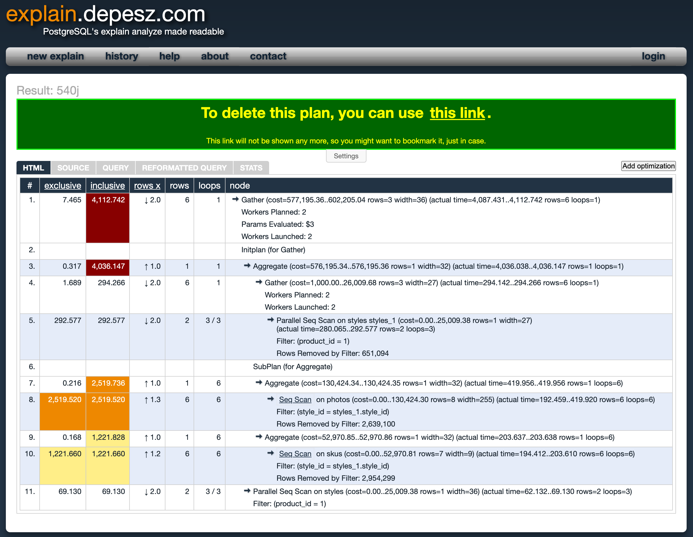

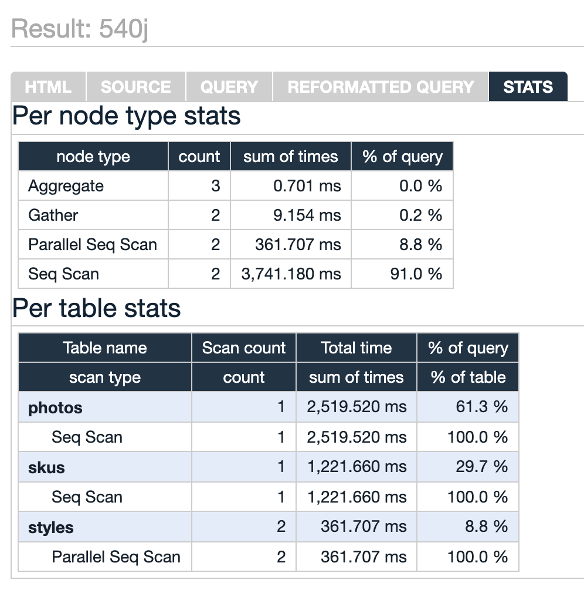


Things I've tried to speed up the queries.
- Indexing on all primary keys and any place where a column is used to filter.
- Removing the 'express-promise-router'
- Eliminating routes altogether and just writing the query directly in the server.
- Simplifying the query to the very basics. Even a simple `SELECT * FROM product WHERE product_id = 1` takes 35 ms. How in the WORLD are we supoosed to get a complex query with subqueries or joins under 10 ms?!?!?!
  - Unless... Maybe it's not the query or database afterall... When running a query with EXPLAIN ANALYZE before the query string, the same query reportedly took 0.053 ms to plan and 0.030 ms to execute... It's similar when running that simple query in the postgres terminal. Something weird might be going on with the pg pool... Or we are just measuring the wrong thing (i.e. the 50 ms requirement might be the query and not the time expected for the database to return results...)

My plan is to just deploy what I have and book office hours to try to figure out why it's so slow and what I can do to speed the queries up...

---

Other activities today: AWS account created. Spun up an EC2 instance but the key downloaded was a .cer file and not a .pem file. I might have missed an option somewhere. There are scripts people have dropped in stack overflow to convert .cer files into .pem files but the two I tried didn't work. Hopefully I didn't just install a bitcoin miner on my local machine... 😬 It's now 11:30pm. 😴 I'm going to start over in the morning.

## Daily Reflections 2021-05-13 W9D4

.cer vs .pem file - Turns out it seems like [either is ok.](https://stackoverflow.com/questions/23225112/amazon-aws-ec2-getting-a-cer-file-instead-of-pem/23595139) Further, at the suggestion of my group mates, I opened the .cer file up in a text editor and it appears to be in the same format as .pem. I'll try the .cer file directly first and if it doesn't work, rename it as .pem.

This is how I'm setting up my AWS EC2 instance:

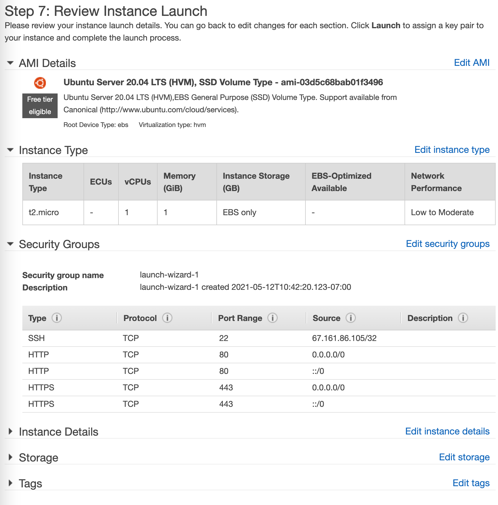

This seems unimportant, but I'm adding it here so I remember what it looks like before I download the wrong file...

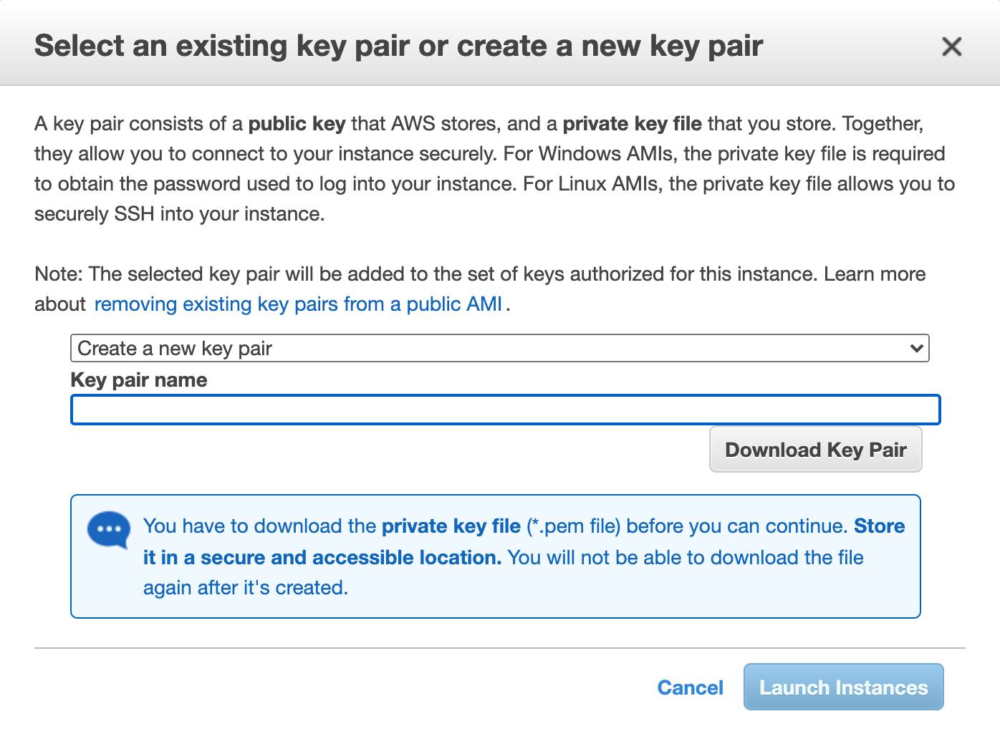

I'm forced to download a .cer file instead of a .pem file. I can rename the file and change the extension, but it doesn't seem to work. I keep getting a messages that says it's a public key even though when I open the private key with a text editor, it states -BEGIN RSA PRIVATE KEY-. Yes, I did the chmod 400 thing to lock it's permissions.

I ended up creating a new instance and changed the file format while saving to "all files" and naming the key with .pem. That worked.

There was some speculation that the async/await or routers might be causing the slow down. To test this, I copied and pasted the query directy into the server index file and wrote the query as a promise and chained .then() to it.The result was still poor. 4.4 seconds. The code is as follows:

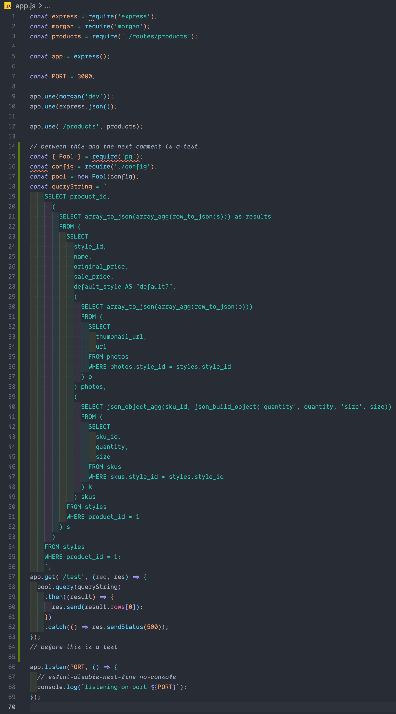

In setting up the database on the EC2 instance, [this Logrocket article](https://blog.logrocket.com/setting-up-a-remote-postgres-database-server-on-ubuntu-18-04/) was EXTREMELY helpful.

### Breakthrough!

Had to call out the big dogs but after 30 minutes of debugging, Josh finally found the issue. I had inadvertantly created two databases. One was being indexed and one was not. psql was querying the indexed database and pg was querying the non-indexed database. The performance improvements are significant.

ACTUAL results of pre and post indexing with 10 vus, 30s duration, 1 s sleep, and hitting beginning, middle, and end, of the database:

| Description      | k6 avg pre-index | k6 avg w/indexing |
| ---------------- | ------ | --- |
| List Products    | 213 ms  |  ms |
| Product Info     | 283 ms | 7.77 ms |
| Product Styles   | 4.74 s | 4.73 ms |
| Related Products | 159 ms | 6.17 ms |

---

login to EC2 instance

ssh -i "SDC.pem" ubuntu@ec2-35-167-245-107.us-west-2.compute.amazonaws.com

to exit ssh, exit then enter or ctrl+d

[Here](https://betterprogramming.pub/how-to-provision-a-cheap-postgresql-database-in-aws-ec2-9984ff3ddaea) is a really great guide I followed to install postgres onto an EC2 instance.

## Daily Reflections 2021-05-14 W9D5

Refresh Ubuntu packages:

    sudo apt-get update -y && sudo apt-get upgrade -y

Install node: 

    curl -fsSL https://deb.nodesource.com/setup_16.x | sudo -E bash -
    sudo apt-get install -y nodejs

Install non-Node build tools: 

    sudo apt-get install gcc g++ make

Install git:

    sudo apt-get install git

Reroute all traffic received at :80 to :3000 instead. Match the port in your security config and app. Later change this to allow for load balancing.

    sudo iptables -t nat -A PREROUTING -i eth0 -p tcp --dport 80 -j REDIRECT --to-port 3000

Install Postgres:

    sudo apt install postgresql -y

Create a new user:

    sudo -u postgres createuser --interactive --pwprompt
    Enter name of role to add: dbuser
    Enter password for new role: ************
    Enter it again: ************
    Shall the new role be a superuser? (y/n) n
    Shall the new role be allowed to create databases? (y/n) y
    Shall the new role be allowed to create more new roles? (y/n) y

Create a new database:

    sudo -u postgres createdb -O dbuser products

Log back into postgres to verify the user and database creation.

    sudo -u postgres psql
    \du
    \l

    GRANT TEMP ON DATABASE postgres TO dbuser;
    GRANT SELECT, INSERT, UPDATE, DELETE ON ALL TABLES IN SCHEMA public TO dbuser;
    GRANT EXECUTE ON ALL FUNCTIONS IN SCHEMA public TO dbuser;
    GRANT USAGE ON ALL SEQUENCES IN SCHEMA public TO dbuser;

I can log into the database with `sudo -u postgres psql products` but not with `sudo -u dbuser psql prodcts` or even if I add a `-W` somewhere in the command. Not sure what's going on...

This is why I was having trouble logging in... [peer authentication requires the current UNIX user to have the same user name as psql](https://gist.github.com/AtulKsol/4470d377b448e56468baef85af7fd614) This can be changed by changing the "TYPE DATABASE USER ADDRESS METHOD" from peer to md5 in the pg_hba.conf file.

Navigate to postgresql.conf file at /etc/postgresql/13/main/

Change  sudo nano postgresql.conf Allow the Postgres server to listen on the DNS name of the EC2 instance. Uncomment listen_addresses and change it's value to = '*'.

Navigate to pg_hba.conf file at /etc/postgresql/13/main/

Change  sudo nano pg_hba.conf Allow authentications from remote connections. Change IP addresses to 0.0.0.0/0 and ::/0. Uncomment listen_addresses and change it's value to = '*'.

Allow port 5432 through the firewall

    sudo ufw allow 5432/tcp

Restart postgres:

    sudo systemctl restart postgresql

From the root login you can login to the database with this.

    psql -U dbuser -d products

Postgres can now be logged into remotely with this:

    psql -h 35.167.245.107 -d products -U dbuser

To [transfer files to a remote database](https://stackoverflow.com/questions/1237725/copying-postgresql-database-to-another-server) from the local machine [pg_dump](https://www.postgresql.org/docs/9.6/app-pgdump.html) can be used to extract a PostgreSQL database into a script file or other archive file, which psql can then run to recreate the database remotely:


    pg_dump -C -c postgres | psql -h 35.167.245.107 -U dbuser products

-C or --create creates the database

-c or --clean drops the database objects prior to outputting the commands for creating them

-h **host** or --host=**host** specifies the host name of the machine on which the server is running.

-U **username** or --username=**username** username to connect as.

The database took about 30 minutes to upload but it appears to be running on the EC2 instance. The config file was modified to connect to the aws ec2 instead of the local postgres database.

Next, I'm going to test to verify I'm returning results from the correct database by inserting dummy data into the database through the ssh and verify I can retrieve it.

    INSERT INTO product (product_id, name, slogan, description, category, default_price) VALUES (1000012, 'Test Name', 'Test Slogan', 'Test Description', 'Test Category', 1);

I ran into an issue where I couldn't insert items into the database because I setup the dbuser on the wrong database. I tried to log into the superuser postgres but it was asking for a password I had not set. After some googling, I found that I should not have changed permissions on the Database administrative login by Unix domain socket to md5, which I must have done. This should be left as peer. I changed it back and was able to login. Lesson learned.

Setting up the server instance was pretty easy and very much similar to the database setup except for cloning the git repo, installing node packages, and editing the config file to point to the database on the other EC2 instance. It's up and working. Morgan loging was briefly turned on to test response times between the ec2 server and the ec2 database. It was returning 5-19 ms! Postman was 30-90 ms depending on the product_id which indicates the additional time the network takes between my machine and the ec2 instance.

Also - I lucked out and both instances I created were on the same subnet, but for fugure reference, it's important to add them to a subnet group BEFORE creating them. Otherwise it has to be [manually migrated](https://aws.amazon.com/premiumsupport/knowledge-center/move-ec2-instance/), which sounds like a total pain.

Next, I want to figure out how to have node persist after I close the ssh connection. Several options were suggested to explore, including:

- [Forever.js](https://www.npmjs.com/package/forever) (npm module)
- [PM2](https://www.npmjs.com/package/pm2) (npm module with more downloads and more support)
- [tmux](https://www.hamvocke.com/blog/a-quick-and-easy-guide-to-tmux/) (does a lot. Not exactly light weight for what I'm looking for)
- or [screen](https://www.rackaid.com/blog/linux-screen-tutorial-and-how-to/) (installed via yum, comes highly rated, and very lightweight) <- giving this a try first.


Need load balances for each server endpoint. Need a load balancer to direct to different clients too.

loader.io for deployed testing

And I think I randomly found what I was looking for to just return the value and not an object with a key value pair. This is from the [pg documentaiton](https://node-postgres.com/features/queries)


---

## References and Handy Dandy Links

- [Postgres Cheat Sheet](https://www.postgresqltutorial.com/postgresql-cheat-sheet/)
- [Postgres Cheat Sheet (pdf)](https://www.postgresqltutorial.com/wp-content/uploads/2018/03/PostgreSQL-Cheat-Sheet.pdf)
- [How to run an SQL file in Postgres](https://kb.objectrocket.com/postgresql/how-to-run-an-sql-file-in-postgres-846)
- [17 Practial psql Commands That You Don't Want To Miss](https://www.postgresqltutorial.com/psql-commands/)
- [Another Postgresql cheatsheet](https://karloespiritu.github.io/cheatsheets/postgresql/)

